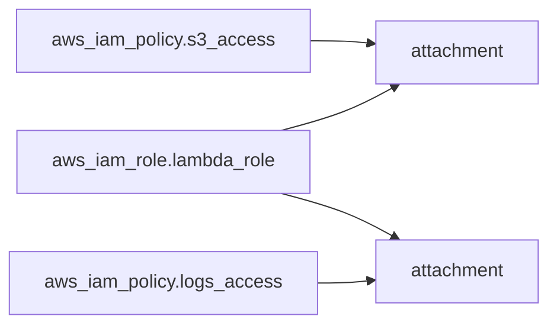

# terraform2sheet 改善提案

このドキュメントでは、terraform2sheetの現在の実装に対する改善提案をまとめています。

## 🎯 優先度: 高

### 1. AIによる説明文の自動生成機能

**現状の課題:**
- リソースパラメータの説明がTerraform providerのschema.jsonから取得される英語のdescriptionのみ
- 日本語での説明がない
- ユーザーにとって理解しにくい技術的な説明が多い

**改善案:**
- ユーザーが用意したJSONファイルに日本語の説明を記述
- そのJSONファイルを読み込んでschema.jsonのdescriptionを上書き
- 必要に応じて、`claude -p`コマンドで説明文を生成してJSONに書き込むヘルパースクリプトを提供

**実装イメージ:**

```bash
# カスタム説明文を使用
tfplan-viewer.py -p plan.json -s schema.json --descriptions custom_descriptions.json
```

**カスタム説明JSONの形式:**
```json
{
  "aws_iam_role": {
    "name": "IAMロールの識別名",
    "assume_role_policy": "このロールを引き受けることができるエンティティを定義するポリシー"
  },
  "aws_s3_bucket": {
    "bucket": "S3バケットの一意な名前",
    "tags": "バケットに付与するタグ"
  }
}
```

**メリット:**
- パラメータシートが日本語で読みやすくなる
- 非技術者でも理解しやすいドキュメントになる
- レビュー時の効率が向上
- 説明文をバージョン管理できる

### 2. List型テーブルの実装

**現状の課題:**
- すべてのリソースが1リソース1テーブルの"Individual"型で表示される
- 同じタイプのリソースが複数ある場合、ページが縦に長くなりスクロールが大変

**改善案:**
- Security Groupなど複数インスタンスがあるリソースタイプを1つの表で表示
- 各リソースを1行に要約して表示

**実装イメージ:**

```html
<!-- List型テーブルの例: Security Groups -->
<table>
  <thead>
    <tr>
      <th>Resource Name</th>
      <th>Name/Tags</th>
      <th>VPC</th>
      <th>Ingress Rules</th>
      <th>Egress Rules</th>
    </tr>
  </thead>
  <tbody>
    <tr>
      <td>web_sg</td>
      <td>web-security-group</td>
      <td>(ref) main-vpc</td>
      <td>3 rules</td>
      <td>1 rule</td>
    </tr>
    <tr>
      <td>db_sg</td>
      <td>db-security-group</td>
      <td>(ref) main-vpc</td>
      <td>2 rules</td>
      <td>1 rule</td>
    </tr>
  </tbody>
</table>
```

**実装手順:**
1. `lib/resource_config.py`に`table_type: "list"`と`list_columns`設定を追加
2. `lib/html_view.py`に`_generate_list_table()`関数を実装
3. 各リソースタイプごとに表示カラムを定義

**対象リソース例:**
- `aws_security_group`, `aws_security_group_rule`
- `aws_subnet`
- `aws_route_table`, `aws_route`
- `aws_iam_user`, `aws_iam_group`

### 3. 変更差分の視覚化（Create/Update/Delete）

**現状の課題:**
- plan.jsonには`create`, `update`, `delete`などのアクション情報が含まれているが表示されていない
- どのリソースが新規作成なのか、更新なのか、削除なのかが分からない

**改善案:**
- リソース名の横にバッジを表示（CREATE, UPDATE, DELETE, NO-OP）
- 色分けで視覚的に区別
  - 緑: CREATE
  - 黄: UPDATE
  - 赤: DELETE
  - グレー: NO-OP

**実装イメージ:**

```html
<h2>
  aws_iam_role.example
  <span class="badge badge-create">CREATE</span>
</h2>
```

**実装手順:**
1. `plan.json`の`resource_changes[].change.actions`を解析
2. Phase 1で各リソースに`action`フィールドを追加
3. HTMLビューでバッジを生成
4. CSSでバッジのスタイリング

**メリット:**
- Terraformのdry-runと同等の情報を可視化
- 意図しない削除や変更に気づきやすくなる

## ⚡ 優先度: 中

### 4. モジュール構造の可視化

**現状の課題:**
- モジュール情報は`module`フィールドに保持されているが、HTMLでは平坦に表示される
- どのリソースがどのモジュールに属しているかが分かりにくい

**改善案:**
- モジュール別にセクションを分けて表示
- 階層構造を視覚化（インデント、折りたたみ）

**実装イメージ:**

```
html_output/
├── index.html
├── root/
│   ├── iam_role.html
│   └── s3_bucket.html
└── modules/
    ├── network/
    │   ├── vpc.html
    │   └── subnet.html
    └── compute/
        └── instance.html
```

### 5. リソース依存関係グラフの生成

**現状の課題:**
- リソース間の参照関係は解決されているが、全体像が見えない
- どのリソースがどのリソースに依存しているかの視覚化がない

**改善案:**
- Mermaid.jsまたはGraphvizを使用して依存関係図を生成
- HTMLレポートに埋め込み

**実装イメージ:**



### 6. 検索・フィルタリング機能

**現状の課題:**
- HTMLファイルが複数に分かれており、リソースを探すのが大変
- 特定のタグやパラメータでフィルタリングできない

**改善案:**
- JavaScript実装のクライアントサイド検索
- 以下の条件でフィルタリング:
  - リソースタイプ
  - リソース名
  - タグ
  - パラメータ値

**実装イメージ:**

```html
<!-- index.htmlに検索ボックスを追加 -->
<input type="text" id="search" placeholder="Search resources...">
<select id="filter-type">
  <option value="">All Types</option>
  <option value="aws_iam_role">IAM Role</option>
  <option value="aws_s3_bucket">S3 Bucket</option>
</select>
```

### 7. コスト見積もり情報の統合

**現状の課題:**
- リソースのコスト情報が表示されていない

**改善案:**
- Infracost CLIと連携してコスト見積もりを表示
- 各リソースの推定月額コストを表示

**実装イメージ:**

```bash
# Infracostと連携
infracost breakdown --path . --format json > cost.json
tfplan-viewer.py -p plan.json -s schema.json --cost cost.json
```

### 8. エクスポート機能

**現状の課題:**
- HTMLのみの出力で、他のツールとの連携が困難

**改善案:**
- CSV、Excel、Markdown形式での出力オプション

**実装イメージ:**

```bash
tfplan-viewer.py -p plan.json -s schema.json --format csv -o output.csv
tfplan-viewer.py -p plan.json -s schema.json --format xlsx -o output.xlsx
tfplan-viewer.py -p plan.json -s schema.json --format markdown -o output.md
```

## 🔧 優先度: 低

### 9. Webサーバーモード

**改善案:**
- 簡易的なWebサーバーを起動してHTMLを配信
- ファイルシステムを直接開く必要がなくなる

**実装イメージ:**

```bash
tfplan-viewer.py -p plan.json -s schema.json --serve --port 8080
# http://localhost:8080 でアクセス
```

### 10. CI/CD統合

**改善案:**
- GitHub ActionsやGitLab CIとの連携例を提供
- Pull Request時に自動でパラメータシートを生成してコメント

**実装イメージ:**

```yaml
# .github/workflows/terraform-plan.yml
- name: Generate parameter sheet
  run: |
    terraform plan -out=tfplan
    terraform show -json tfplan > plan.json
    terraform providers schema -json > schema.json
    tfplan-viewer.py -p plan.json -s schema.json -o html_output

- name: Upload artifact
  uses: actions/upload-artifact@v3
  with:
    name: parameter-sheet
    path: html_output/
```

### 11. 他のクラウドプロバイダー対応

**改善案:**
- GCP、Azure、その他のTerraformプロバイダーに対応
- プロバイダー別のリソース設定ファイルを用意

### 12. プラグインシステム

**改善案:**
- カスタムプロセッサをプラグインとして追加できる仕組み
- ユーザー独自の特殊処理を外部ファイルで定義

**実装イメージ:**

```python
# plugins/my_custom_processor.py
def process_custom_resource(resource, extracted_data):
    # Custom processing logic
    return modified_resource

# 実行時にロード
tfplan-viewer.py -p plan.json -s schema.json --plugin plugins/my_custom_processor.py
```

## 📊 実装の優先順位まとめ

| 優先度 | 機能 | 実装難易度 | 効果 | 推奨実装順 |
|--------|------|-----------|------|-----------|
| 🔴 高 | AIによる説明文生成 | 低 | 大 | 1 |
| 🔴 高 | List型テーブル | 中 | 大 | 2 |
| 🔴 高 | 変更差分の視覚化 | 低 | 大 | 3 |
| 🟡 中 | モジュール構造可視化 | 中 | 中 | 4 |
| 🟡 中 | 依存関係グラフ | 高 | 中 | 5 |
| 🟡 中 | 検索・フィルタリング | 中 | 中 | 6 |
| 🟡 中 | コスト見積もり統合 | 中 | 大 | 7 |
| 🟡 中 | エクスポート機能 | 低 | 小 | 8 |
| 🟢 低 | Webサーバーモード | 低 | 小 | 9 |
| 🟢 低 | CI/CD統合 | 低 | 中 | 10 |
| 🟢 低 | 他クラウド対応 | 高 | 中 | 11 |
| 🟢 低 | プラグインシステム | 高 | 小 | 12 |

## 💡 最優先で実装すべき機能

**1位: AIによる説明文生成**
- 理由: パラメータシートの読みやすさが飛躍的に向上
- 実装: JSONファイルで説明文を管理するシンプルな方式
- 効果: 非技術者でも理解可能なドキュメントになる

**2位: List型テーブル**
- 理由: HTMLの可読性が大幅に向上
- 実装: 既存のIndividual型と並行して実装可能
- 効果: ページのスクロール量が減り、一覧性が向上

**3位: 変更差分の視覚化**
- 理由: Terraformの実行前チェックが容易になる
- 実装: plan.jsonに既に含まれているデータを使うだけ
- 効果: 意図しない変更の検出が容易になる

## 🚀 実装ロードマップ案

### Phase 1: 基本機能の充実（1-2週間）
- [x] README.md作成
- [ ] AI説明文生成機能（カスタムJSON方式）
- [ ] 変更差分の視覚化
- [ ] List型テーブル実装（Security Group, Subnetなど）

### Phase 2: AI統合（1-2週間）
- [ ] 説明文JSONファイルの管理
- [ ] 説明文生成ヘルパースクリプト（claude -p使用）

### Phase 3: 高度な可視化（3-4週間）
- [ ] モジュール構造の可視化
- [ ] 依存関係グラフの生成
- [ ] 検索・フィルタリング機能

### Phase 4: 外部ツール連携（2-3週間）
- [ ] Infracostとの統合
- [ ] CI/CD連携サンプル
- [ ] エクスポート機能

## 📝 その他の提案

### ドキュメント改善
- [ ] 各AWSリソースタイプの設定例を追加
- [ ] トラブルシューティングガイドの充実
- [ ] 動画チュートリアルの作成

### テストの強化
- [ ] ユニットテストの追加（pytest）
- [ ] 統合テストの自動化
- [ ] 大規模プランファイル（100+リソース）でのテスト

### パフォーマンス最適化
- [ ] 大きなplan.jsonの処理速度改善
- [ ] 並列処理の導入
- [ ] 不要なschema情報の事前フィルタリング
