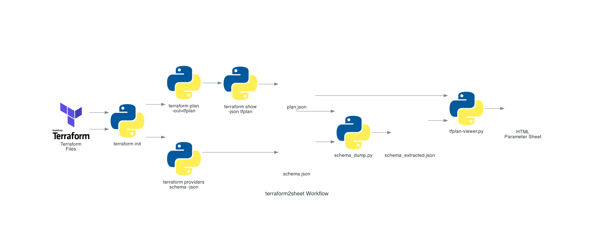
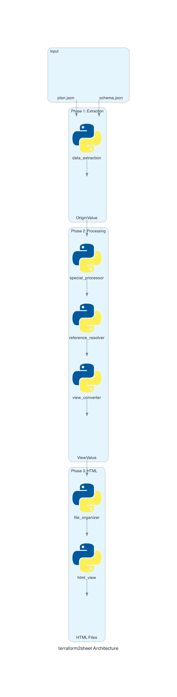

# terraform2sheet

TerraformのプランファイルとスキーマファイルからHTMLパラメータシートを生成するツール

## 概要

terraform2sheetは、Terraformの`plan.json`と`schema.json`を解析し、人間が読みやすいHTMLレポートを生成します。AWSリソースのパラメータ、参照関係、IAMポリシーなどを視覚的に整理して表示します。



### 主な機能

- 📊 リソースタイプ別にHTMLテーブルを自動生成
- 🔗 リソース間参照の自動解決（例: `aws_iam_role.example` → `example-role-name`）
- 📁 階層的なディレクトリ構造での出力（例: `aws/iam/role.html`）
- 📝 大きなJSONポリシーの折りたたみ表示
- 🎯 IAM関連リソースの自動統合（Role Policy Attachmentを親Roleに統合）
- ⚙️ カスタマイズ可能な設定ファイル

## クイックスタート

### 1. 必要なファイルを準備

```bash
# Terraformディレクトリに移動
cd /path/to/your/terraform

# Terraformを初期化
terraform init

# プランファイルを生成
terraform plan -out=tfplan

# JSONファイルに変換
terraform show -json tfplan > plan.json
terraform providers schema -json > schema.json
```

### 2. スキーマファイルの抽出（推奨）

plan.jsonで使用されているリソースタイプのみをschema.jsonから抽出することで、ファイルサイズを削減できます。

```bash
/path/to/terraform2sheet/bin/schema_dump.py \
  -p plan.json \
  -s schema.json \
  -o schema_extracted.json
```

### 3. HTMLレポートを生成

```bash
/path/to/terraform2sheet/bin/tfplan-viewer.py \
  -p plan.json \
  -s schema_extracted.json \
  -o html_output
```

### 4. レポートを確認

```bash
open html_output/index.html
```

## コマンドオプション

### tfplan-viewer.py

基本的なHTMLレポート生成ツール。

```bash
tfplan-viewer.py -p <plan.json> -s <schema.json> [options]
```

**必須オプション:**
- `-p, --plan`: Terraform plan JSONファイルのパス
- `-s, --schema`: Terraform provider schema JSONファイルのパス

**オプション:**
- `-o, --output-dir`: HTML出力ディレクトリ（デフォルト: `html_output`）
- `--title`: HTMLレポートのタイトル（デフォルト: "Terraform Plan"）
- `--special-config`: カスタム特殊リソース設定ファイル
- `--identifier-config`: カスタム識別子設定ファイル
- `--dump-special-config FILE`: デフォルト特殊リソース設定をJSONで出力
- `--dump-identifier-config FILE`: デフォルト識別子設定をJSONで出力

**例:**

```bash
# 基本的な使用
tfplan-viewer.py -p plan.json -s schema.json

# カスタムタイトルと出力先を指定
tfplan-viewer.py -p plan.json -s schema.json \
  -o my_report \
  --title "Production Environment"

# カスタム設定ファイルを使用
tfplan-viewer.py -p plan.json -s schema.json \
  --special-config my_special.json \
  --identifier-config my_identifiers.json

# デフォルト設定をエクスポート
tfplan-viewer.py --dump-special-config special_default.json
tfplan-viewer.py --dump-identifier-config identifiers_default.json
```

### schema_dump.py

plan.jsonで使用されているリソースタイプのみをschema.jsonから抽出するユーティリティ。

```bash
schema_dump.py -p <plan.json> -s <schema.json> [options]
```

**必須オプション:**
- `-p, --plan`: Terraform plan JSONファイルのパス
- `-s, --schema`: Terraform provider schema JSONファイルのパス

**オプション:**
- `-o, --output`: 出力ファイル名（デフォルト: `schema_extracted.json`）

**例:**

```bash
schema_dump.py -p plan.json -s schema.json
schema_dump.py -p plan.json -s schema.json -o minimal_schema.json
```

## 出力構造

生成されるHTMLファイルは以下のような階層構造になります：

```
html_output/
├── index.html              # 目次ページ（リソース一覧）
└── aws/
    ├── iam/
    │   ├── role.html
    │   ├── policy.html
    │   └── user_group.html
    ├── s3/
    │   ├── bucket.html
    │   └── bucket_policy.html
    ├── lambda/
    │   └── function.html
    ├── vpc/
    │   └── vpc.html
    └── ec2/
        ├── instance.html
        └── security_group.html
```

## 高度な機能

### 特殊リソース設定

依存リソースを親リソースに統合する設定です。例えば、`aws_iam_role_policy_attachment`を`aws_iam_role`に統合できます。

**デフォルト設定をエクスポート:**

```bash
tfplan-viewer.py --dump-special-config special.json
```

**設定例 (special.json):**

```json
[
  {
    "type": "aws_iam_role_policy_attachment",
    "merge_into": {
      "parent_type": "aws_iam_role",
      "parent_key": "attached_policies",
      "match_by": "role",
      "exclude_keys": ["role", "id"]
    }
  }
]
```

**カスタム設定で実行:**

```bash
tfplan-viewer.py -p plan.json -s schema.json --special-config special.json
```

### 識別子設定

参照解決時にリソースを識別するための属性を指定します。

**デフォルト設定をエクスポート:**

```bash
tfplan-viewer.py --dump-identifier-config identifiers.json
```

**設定例 (identifiers.json):**

```json
{
  "aws_iam_role": "name",
  "aws_iam_policy": "name",
  "aws_s3_bucket": "bucket",
  "aws_vpc": "tags.Name",
  "aws_subnet": "tags.Name"
}
```

**カスタム設定で実行:**

```bash
tfplan-viewer.py -p plan.json -s schema.json --identifier-config identifiers.json
```

## システムアーキテクチャ

terraform2sheetは3つのフェーズでデータを変換します：



**Phase 1: Data Extraction**
- plan.jsonとschema.jsonから生データを抽出
- OriginValueオブジェクトに変換（値と参照を保持）

**Phase 2: Data Processing**
- 特殊リソースの処理（例: IAM Role Policy Attachmentの統合）
- リソース参照の解決
- ViewValueオブジェクトに変換（表示用データ）

**Phase 3: HTML Generation**
- リソースタイプ別にHTMLファイルを生成
- 階層的なディレクトリ構造で出力

## ディレクトリ構造

```
terraform2sheet/
├── README.md               # このファイル
├── IMPROVEMENTS.md         # 改善提案
├── bin/
│   ├── tfplan-viewer.py    # メインスクリプト
│   └── schema_dump.py      # スキーマ抽出ユーティリティ
├── lib/
│   ├── data_extraction.py       # Phase 1: データ抽出
│   ├── special_processor.py     # Phase 2-1: 特殊リソース処理
│   ├── reference_resolver.py    # Phase 2-2: 参照解決
│   ├── view_converter.py        # Phase 2-3: ビュー変換
│   ├── file_organizer.py        # Phase 3: HTML生成・ファイル編成
│   ├── special_config.py        # 特殊リソース設定
│   ├── identifier_config.py     # 識別子設定
│   ├── resource_config.py       # リソース設定
│   └── html_view.py             # HTML生成
├── spec/                   # 仕様書
├── tests/                  # テストケース
└── done.md                 # 開発履歴
```

## 対応リソースタイプ

現在、以下のAWSリソースタイプに対応しています：

- **IAM**: role, policy, user, group, role_policy_attachment
- **S3**: bucket, bucket_policy, bucket_versioning, bucket_encryption
- **Lambda**: function, permission
- **VPC**: vpc, subnet, internet_gateway, nat_gateway, route_table
- **EC2**: instance, security_group, security_group_rule, key_pair
- **RDS**: db_instance, db_subnet_group, db_parameter_group
- **CloudWatch**: log_group, metric_alarm

その他のリソースタイプも基本的な表示は可能ですが、カスタムファイル配置や特殊処理は設定されていません。

## トラブルシューティング

### plan.jsonまたはschema.jsonが見つからない

```bash
# ファイルが存在するか確認
ls -la plan.json schema.json

# Terraformコマンドを再実行
terraform plan -out=tfplan
terraform show -json tfplan > plan.json
terraform providers schema -json > schema.json
```

### "ERROR: File not found" エラー

ファイルパスを絶対パスで指定してください：

```bash
tfplan-viewer.py \
  -p /absolute/path/to/plan.json \
  -s /absolute/path/to/schema.json
```

### schema.jsonが大きすぎる

`schema_dump.py`を使用して必要なリソースタイプのみを抽出してください：

```bash
schema_dump.py -p plan.json -s schema.json -o schema_extracted.json
tfplan-viewer.py -p plan.json -s schema_extracted.json
```

## ライセンス

未定

## 貢献

バグ報告や機能要望は Issues にてお願いします。

## 作成者

terraform2sheet development team
