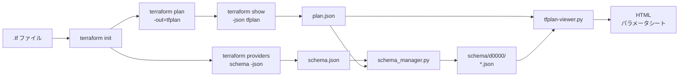
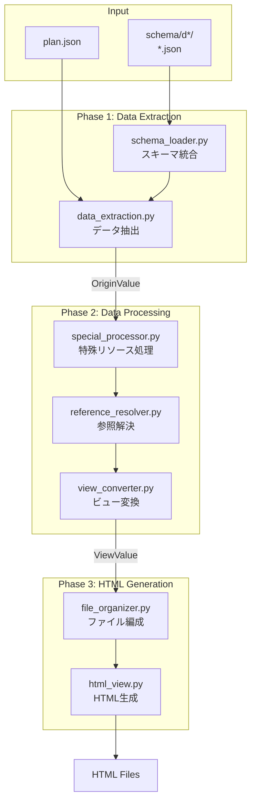

# tfplan-viewer

TerraformのプランファイルとスキーマからHTMLパラメータシートを生成するツール

## 概要

tfplan-viewerは、Terraformの`plan.json`とプロバイダースキーマを解析し、人間が読みやすいHTMLレポートを生成します。AWSリソースのパラメータ、参照関係、IAMポリシーなどを視覚的に整理して表示します。



### 主な機能

- リソースタイプ別にHTMLテーブルを自動生成
- リソース間参照の自動解決（例: `aws_iam_role.example` → `example-role-name`）
- 階層的なディレクトリ構造での出力（例: `aws/iam/role.html`）
- 大きなJSONポリシーの折りたたみ表示
- IAM関連リソースの自動統合（Role Policy Attachmentを親Roleに統合）
- スキーマのリソースタイプ別分割管理と日本語description対応
- カスタマイズ可能な設定ファイル

## クイックスタート

### 1. Terraform出力ファイルを準備

```bash
cd /path/to/your/terraform

terraform init
terraform plan -out=tfplan
terraform show -json tfplan > plan.json
terraform providers schema -json > schema.json
```

### 2. スキーマをリソースタイプ別に分割

`schema_manager.py`でplan.jsonに含まれるリソースタイプのスキーマを個別JSONファイルに分割します。

```bash
/path/to/tfplan-viewer/bin/schema_manager.py \
  -p plan.json \
  -s schema.json \
  -o schema
```

これにより`schema/d0000/`配下にリソースタイプ毎のJSONファイルが生成されます。
2回目以降の実行では、新規リソースタイプのみが`d0001/`, `d0002/`...に追加されます。

### 3. HTMLレポートを生成

```bash
/path/to/tfplan-viewer/bin/tfplan-viewer.py \
  -p plan.json \
  -s schema
```

`-s`にはスキーマディレクトリを指定します（デフォルト: `schema`）。

### 4. レポートを確認

```bash
open html_output/index.html
```

## コマンドリファレンス

### tfplan-viewer.py

HTMLレポート生成ツール。

```bash
tfplan-viewer.py -p <plan.json> [-s <schema_dir>] [options]
```

| オプション | デフォルト | 説明 |
|---|---|---|
| `-p, --plan` | (必須) | Terraform plan JSONファイル |
| `-s, --schema` | `schema` | スキーマディレクトリ |
| `-o, --output-dir` | `html_output` | HTML出力ディレクトリ |
| `--title` | `"Terraform Plan"` | HTMLレポートのタイトル |
| `--special-config` | - | カスタム特殊リソース設定ファイル |
| `--identifier-config` | - | カスタム識別子設定ファイル |
| `--dump-special-config FILE` | - | デフォルト特殊リソース設定をエクスポート |
| `--dump-identifier-config FILE` | - | デフォルト識別子設定をエクスポート |

### schema_manager.py

plan.jsonで使用されるリソースタイプのスキーマを個別JSONファイルに分割・管理するツール。

```bash
schema_manager.py -p <plan.json> -s <schema.json> [-o <output_dir>]
```

| オプション | デフォルト | 説明 |
|---|---|---|
| `-p, --plan` | (必須) | Terraform plan JSONファイル |
| `-s, --schema` | (必須) | Terraform provider schema JSONファイル |
| `-o, --output` | `schema` | 出力ディレクトリ |

### schema_dump.py

schema.jsonからplan.jsonで使用されるリソースタイプのみを抽出するユーティリティ（レガシー）。

```bash
schema_dump.py -p <plan.json> -s <schema.json> [-o <output.json>]
```

## システムアーキテクチャ

tfplan-viewerは3つのフェーズでデータを変換します。



**Phase 1: Data Extraction**
- schema_loaderがschema/d*/配下の個別JSONを統合
- plan.jsonとスキーマからOriginValueオブジェクトを生成

**Phase 2: Data Processing**
- 特殊リソースの処理（例: IAM Role Policy Attachmentの統合）
- リソース参照の解決
- ViewValueオブジェクトに変換

**Phase 3: HTML Generation**
- リソースタイプ別にHTMLファイルを生成
- 階層的なディレクトリ構造で出力

## ディレクトリ構造

```
tfplan-viewer/
├── README.md
├── CLAUDE.md                # Claude Code設定
├── bin/
│   ├── tfplan-viewer.py     # メインスクリプト
│   ├── schema_manager.py    # スキーマ分割管理ツール
│   └── schema_dump.py       # スキーマ抽出（レガシー）
├── lib/
│   ├── schema_loader.py     # スキーマディレクトリ読み込み
│   ├── data_extraction.py   # Phase 1: データ抽出
│   ├── special_processor.py # Phase 2-1: 特殊リソース処理
│   ├── reference_resolver.py# Phase 2-2: 参照解決
│   ├── view_converter.py    # Phase 2-3: ビュー変換
│   ├── file_organizer.py    # Phase 3: ファイル編成
│   ├── html_view.py         # HTML生成
│   ├── special_config.py    # 特殊リソース設定
│   ├── identifier_config.py # 識別子設定
│   └── resource_config.py   # リソース設定
├── agents/                  # Claude Codeカスタムサブエージェント
│   └── schema-description.md
├── skills/                  # Claude Codeスキル
│   └── schema-description/
├── spec/                    # 仕様書
└── tests/                   # テストケース
```

## スキーマ管理

### スキーマディレクトリ構造

`schema_manager.py`はリソースタイプごとに個別のJSONファイルを生成します。

```
schema/
├── d0000/                        # 初回抽出
│   ├── aws_iam_role.json
│   ├── aws_s3_bucket.json
│   └── aws_lambda_function.json
└── d0001/                        # 差分抽出（新規リソースのみ）
    └── aws_ec2_instance.json
```

各JSONファイルには日本語descriptionを追加できます。descriptionはHTMLレポートの属性説明として表示されます。

### 日本語description追加

Claude Codeの`schema-description`スキルまたはサブエージェントを使って、スキーマファイルに日本語説明を追加できます。

## 高度な機能

### 特殊リソース設定

依存リソースを親リソースに統合する設定です。

```bash
# デフォルト設定をエクスポート
tfplan-viewer.py --dump-special-config special.json
```

```json
[
  {
    "type": "aws_iam_role_policy_attachment",
    "merge_into": {
      "parent_type": "aws_iam_role",
      "parent_key": "attached_policies",
      "match_by": "role",
      "exclude_keys": ["role", "id"]
    }
  }
]
```

### 識別子設定

参照解決時にリソースを識別するための属性を指定します。

```bash
# デフォルト設定をエクスポート
tfplan-viewer.py --dump-identifier-config identifiers.json
```

```json
{
  "aws_iam_role": "name",
  "aws_iam_policy": "name",
  "aws_s3_bucket": "bucket",
  "aws_vpc": "tags.Name",
  "aws_subnet": "tags.Name"
}
```

## 出力構造

```
html_output/
├── index.html              # 目次ページ
└── aws/
    ├── iam/
    │   ├── role.html
    │   └── policy.html
    ├── s3/
    │   └── bucket.html
    └── lambda/
        └── function.html
```

## ライセンス

未定
